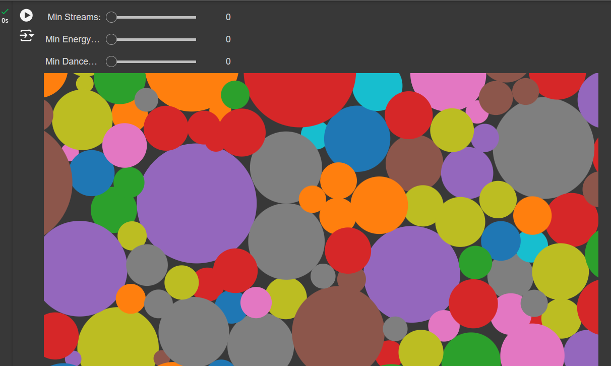

# Apache Beam Data Engineering Assignment 📝  
  
## Overview
This repository contains the deliverables for the Apache Beam data engineering assignment, focusing on Exploratory Data Analysis (EDA), Auto EDA, and Apache Beam features demonstration. The project showcases advanced data analysis and processing techniques using Google Colab.

## Assignment Structure
### a) Complete Dataset EDA in Colab (50% of total marks)
- Dataset: https://www.kaggle.com/datasets/nelgiriyewithana/top-spotify-songs-2023
- Notebook: EDA_Spotify_Most_Streamed_Songs_2023.ipynb
- GoogleColab: https://colab.research.google.com/drive/1AyVSN5H_c19Sa2bVJ76cB3YH8yqU_zmY?usp=sharing
- Objective: Perform a comprehensive EDA using advanced visualization techniques

#### Key Features
1. Loading the dataset
2. Feature Engineering
3. Univariate Analysis
4. Bivariate Analysis
5. Normalization and Standardization
6. Hypothesis Testing
7. Conclusions and Insights

### b) Auto EDA with Sweetviz (25% of total marks)
- Notebook: AutoEDA_Using_Sweetviz.ipynb
- GoogleColab: https://colab.research.google.com/drive/1N_KRcmIre6Y-4h78_DdbZJGp80Mie8hF?usp=sharing
Tool: Sweetviz
- Objective: Demonstrate automated EDA capabilities

#### Key Features
- Load Dataset
- Quick and comprehensive data overview
- Automated feature analysis and comparisons
Interactive HTML report generation

### c) Apache Beam Features Demonstration (25% of total marks)
- Notebook: Apache_beam_features.ipynb
- GoogleColab: https://colab.research.google.com/drive/1WbEcxvAE8-py06Ewer2Nvt8qaV6rkYj3?usp=sharing
- Objective: Showcase Apache Beam's key features

#### Demonstrated Features:
- Apache Beam Pipeline for Transforming and Printing Data
- Composite Transform
- Pipeline IO
- Triggers
- Windowing
- ParDo